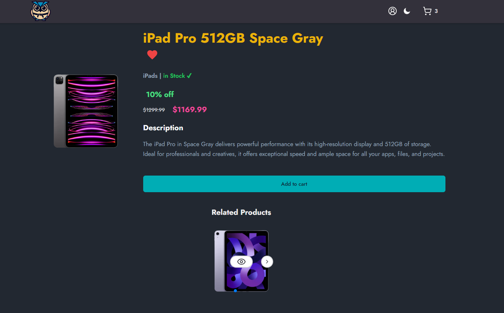
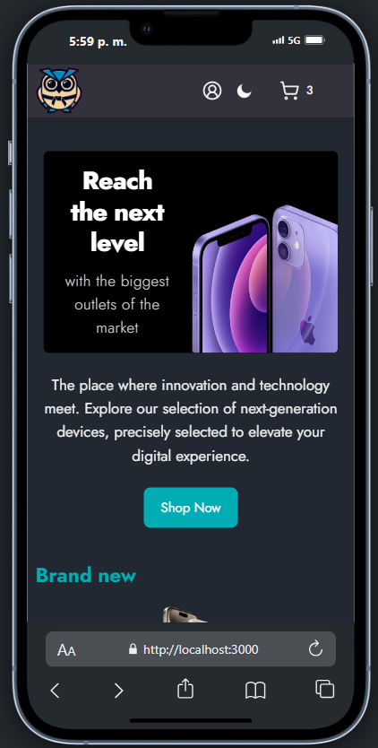

# Owltlet - e-Commerce

Owltlet es una moderna aplicación de **e-commerce** diseñada para ofrecer una experiencia de compra fluida y eficiente, especializada en productos de tecnología de vanguardia.

---

## Índice
- [Descripción](#descripción)
- [Características](#principales-características)
- [Tecnologías](#tecnologías-usadas)
- [Arquitectura](#arquitectura-del-proyecto)
- [Instalación](#instalación)
- [Mejoras](#oportunidades-de-mejora)
- [Documentación REST API](#documentacion-rest-api)

---

## Descripción

Owltlet es una tienda en línea que permite a los usuarios comprar productos tecnológicos de última generación. Con funcionalidades completas como autenticación de usuarios, carrito persistente y pagos integrados mediante **PayPal**, guardado de imágenes en la nube con **Cloudinary**, entre otras, Owltlet es una solución completa de e-commerce.

Este proyecto personal, construido en **React**, **Next.js 14** y **MongoDB Atlas**, representa un desafío técnico que asumí para desarrollar una aplicación **fullstack** desde cero. El enfoque fue crear una experiencia sólida en ambos extremos de la aplicación (frontend y backend), abarcando la creación de una API REST propia y otros elementos clave de una tienda en línea.

Puedes ver la app desplegada [aquí](https://google.com).

<div style="display: flex; flex-direction: column; justify-content: center">
	<div style="height: 400px;">
  
  
</div>
</div>


---

## Principales Características

- Autenticación de usuarios (registro, inicio de sesión, activación de cuenta vía email).
- Carrito y sesiones persistentes con **Redux Toolkit** y **MongoDB Atlas**.
- Sistema de pagos integrado con **PayPal**.
- Protección de rutas.
- Soporte para **modo oscuro**.

---

## Tecnologías Usadas

<div style="display: flex; align-items: center; margin-bottom: 8px;">
  
  <span style="margin-left: 8px; font-weight: bold; font-size: 1rem;">React</span>
</div>

<div style="display: flex; align-items: center; margin-bottom: 8px;">
  
  <span style="margin-left: 8px; font-weight: bold; font-size: 1rem;">Typescript</span>
</div>

<div style="display: flex; align-items: center; margin-bottom: 8px;">
  
  <span style="margin-left: 8px; font-weight: bold; font-size: 1rem;">Next.js (v14)</span>
</div>

<div style="display: flex; align-items: center; margin-bottom: 8px;">
  
  <span style="margin-left: 8px; font-weight: bold; font-size: 1rem;">MongoDB Atlas</span>
</div>

<div style="display: flex; align-items: center; margin-bottom: 8px;">
  
  <span style="margin-left: 8px; font-weight: bold; font-size: 1rem;">Mongoose</span>
</div>

<div style="display: flex; align-items: center; margin-bottom: 8px;">
  
  <span style="margin-left: 8px; font-weight: bold; font-size: 1rem;">Redux Toolkit</span>
</div>

<div style="display: flex; align-items: center; margin-bottom: 8px;">
  
  <span style="margin-left: 8px; font-weight: bold; font-size: 1rem;">Tailwind CSS</span>
</div>

<div style="display: flex; align-items: center; margin-bottom: 8px;">
  
  <span style="margin-left: 8px; font-weight: bold; font-size: 1rem;">Zod</span>
</div>

<div style="display: flex; align-items: center; margin-bottom: 8px;">
  
  <span style="margin-left: 8px; font-weight: bold; font-size: 1rem;">PayPal API</span>
</div>

<div style="display: flex; align-items: center; margin-bottom: 8px;">
  
  <span style="margin-left: 8px; font-weight: bold; font-size: 1rem;">Cloudinary API</span>
</div>

---

## Arquitectura del Proyecto

`pages/`: Rutas frontend del proyecto en Next.js.

`backend/`: Controladores y schemas de la base de datos.

`components/`: Donde se almacenan los distintos componentes que integran la app.

`hooks/`: Custom hooks que encapsulan lógica clave para poder ser reutilizada.

`pages/`: Donde se organizan y manejan los distintos endpoints de la REST API.

`services/`: Servicios encargados de hacer peticiones al backend y brindar las respuestas correspondientes al cliente.

`store/`: Configuración y lógica necesaria para el estado global de la app, manejado con Redux Toolkit.

`types/`: Interfaces y tipos que modelan la estructura de los datos manejados en la app.

`utils/`: Funciones auxiliares que brindan utilidad a los diferentes componentes de la app.

---

## Instalación
1. Clona el repositorio:
   ```bash
   git clone https://github.com/juanpeyrot/owltlet_public.git
   ```
2. Instala las dependencias:
   ```bash
   npm install
   ```
3. Crea un archivo `.env` con tus credenciales a partir del archivo `.env.template`.

4. Ejecuta la aplicación en desarrollo:
   ```bash
   npm run dev
   ```

---

## Oportunidades de Mejora
Owltlet es una aplicación totalmente funcional y completa, sin embargo, existen algunas áreas en las que planeo mejorar y agregar nuevas características:

-**Rendimiento**: La app cumple notablemente con medidas de accesibilidad y SEO, pero su rendimiento en cuanto a tiempos de carga es mejorable, principalmente apuntando hacia las imágenes y su renderizado, las cuales podrían optimizarse notoriamente usando herramientas conocidas, tales como [Squoosh](https://squoosh.app/).

-**REST API**: Si bien implementé un middleware básico para la protección de rutas de la API, considero que la utilización de otros mecanismos (ej. JWT) podrían agregar más robustez a la protección de estas rutas.

-**Seguridad**: Los mecanismos de autenticación de usuarios no cuentan con encriptado de contraseñas actualmente, la cual se podría lograr utilizando tecnologías como [bcrypt](https://www.npmjs.com/package/bcrypt).

---

## Documentación REST API


| Recurso   | HTTP               | Endpoint            | Headers                                | Body                                  | Response                               | Justificación                           |
|-----------|----------------------|---------------------|----------------------------------------|---------------------------------------|----------------------------------------|-----------------------------------------|
| Usuario   | POST         | `/api/users`     | `x-api-key: <token>`        | `{ "email": string, "password": string }`                          | 201 Created, JSON con datos de nuevo usuario.  | Registrar un usuario. |
| _No aplica_   | POST           | `/api/auth/login`     | `x-api-key: <token>`        | `{ "nombre": string, "password": string }`| 201 Created, JSON con el usuario logueado. | Loguear un usuario en la plataforma. |
| _No aplica_   | GET        | `/api/auth/verify?token={token}`| `x-api-key: <token>`        | _No aplica_                          | 200 OK, No devuelve datos. | Verificar cuenta de usuario. |
| Producto   | GET     | `/api/products?categories={categories}&order={order}&limit={limit}&offset={offset}`| `x-api-key: <token>`        | _No aplica_        | 200 OK, JSON con los productos filtrados.| Obtener productos según filtros de categorias, orden (asc, desc) y máximo de resultados. |
| Producto   | GET     | `/api/products?filter=new`| `x-api-key: <token>`        | _No aplica_        | 200 OK, JSON con los productos filtrados.| Obtener los productos más recientes. |
| Producto   | GET     | `/api/products?productId={productId}`| `x-api-key: <token>`        | _No aplica_        | 200 OK, JSON con un producto en específico.| Obtener un producto en concreto. |
| Producto   | GET     | `/api/products?relatedTo={product}`| `x-api-key: <token>`        | _No aplica_        | 200 OK, JSON con productos relacionados. | Obtener productos relacionados a un producto en particular. |
| Orden   | POST         | `/api/orders`     | `x-api-key: <token>`        | `{ "isPaid": boolean, "productIds": string[], "total": number, "tax": number, "userEmail": string }`                          | 201 Created, JSON con datos de nueva orden.  | Registrar una nueva orden. |
| Orden   | PUT         | `/api/orders`     | `x-api-key: <token>`        | `{ "orderId": string, "transactionId": string }`                          | 200 Ok, JSON con orden modificada.  | Vincular una orden a una transacción de PayPal. |
| Orden   | GET         | `/api/orders?order={order}`     | `x-api-key: <token>`        | _No aplica_                          | 200 Ok, JSON con datos de la orden.  | Obtener una orden en específico. |
| Orden   | PUT        | `/api/orders?transaction={transaction}`     | `x-api-key: <token>`        | _No aplica_                          | 200 Ok, JSON indicando si la orden se ha marcado como pagada.  | Marcar una orden como pagada, si la transacción se ha completado. |
| Orden   | GET         | `/api/orders?user={user}`     | `x-api-key: <token>`        | _No aplica_                          | 200 Ok, JSON con las ordenes pagadas de un usuario.  | Obtener las ordenes pagadas por un usuario. |
| Categoria   | GET         | `/api/categories`     | `x-api-key: <token>`        | _No aplica_                          | 200 OK, JSON con las categorias de productos disponibles.  | Obtener categorias de productos. |
| Carrito   | GET         | `/api/carts?userEmail={email}`     | `x-api-key: <token>`        | _No aplica_                          | 200 OK, JSON datos del carrito.  | Obtener carrito de compras de un usuario. |
| Carrito   | PUT         | `/api/carts?userEmail={email}`     | `x-api-key: <token>`        | `{ "email": string, "items": CartItem[] }`                          | 200 OK, JSON datos del carrito modificado.  | Crear/actualizar carrito de compras del usuario. |